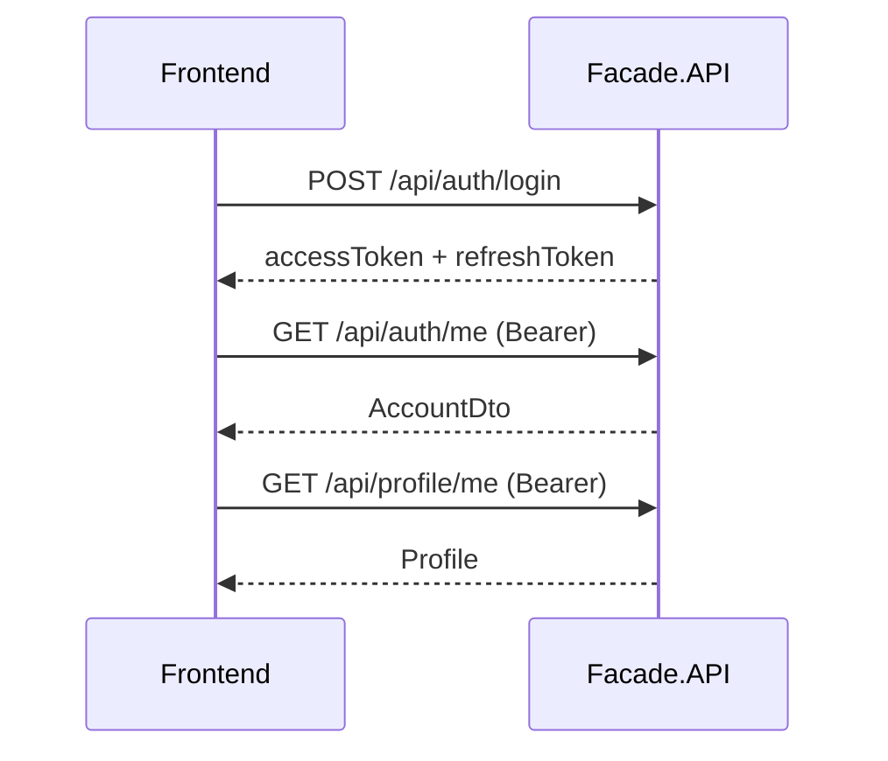

# 10. Frontend Integration Guide

> Практическое руководство для React SPA (`frontend/`) и его связи с backend LinkedInDiplom.  
> **Обновлено:** 2026-06-18 — после анализа расхождений Frontend ↔ Backend и последних интеграций.

**Активный entry:** `frontend/src/main.jsx` → `App.jsx` (маршруты `/app/*`).  
Legacy `router.jsx` / `AppLayout.jsx` **не** используются production bundle.

---

## 1. Базовый URL и proxy

| Среда | Backend URL | Frontend (Vite) |
|-------|-------------|-----------------|
| Dev HTTP | `http://localhost:5000` | `http://localhost:5173` |
| Dev HTTPS | `https://localhost:7011` | `http://localhost:5173` |

В dev frontend по умолчанию использует **same-origin proxy** (`VITE_API_BASE_URL` пустой):

- `/api/*` → `http://localhost:5000`
- `/hubs/*` → `http://localhost:5000` (SignalR)

См. `frontend/vite.config.js` → `server.proxy`.

Опционально в `.env`:

```
VITE_API_BASE_URL=http://localhost:5000
```

CORS в Development разрешает `localhost:5173` с credentials.

---

## 2. JWT — хранение и заголовок

### Login / Register

```
POST /api/auth/login
POST /api/auth/register
```

Response: `accessToken`, `refreshToken`, `expiresAt`.

**Текущий frontend:** tokens в `localStorage` (`shared/api/tokens.js`).

### Каждый protected request

```
Authorization: Bearer <accessToken>
```

### Refresh при 401

```
POST /api/auth/refresh
Body: { "refreshToken": "..." }
```

### Текущий пользователь

```
GET /api/auth/me
```

---

## 3. Auth flow (минимальный)



**External login:** `POST /api/auth/google`, `POST /api/auth/facebook`.

**Активная страница входа:** `pages/auth/Auth.jsx` + `AppContext` (не legacy `AuthPage.jsx` / `AuthContext`).

---

## 4. Статус интеграций (2026-06-18)

Легенда: **Wired** = API-функции + использование в активном UI; **API only** = функции есть, UI частично/не подключён; **N/A** = нет на backend.

| Область | Backend | Frontend API | Активный UI | Примечание |
|---------|---------|--------------|-------------|------------|
| Auth/JWT | ✓ | ✓ | ✓ `Auth.jsx` | — |
| Profile + media | ✓ | ✓ | ✓ `ProfilePage` | — |
| Feed/posts/comments/reactions | ✓ | ✓ | ✓ `HomePage` + `PostCard` | — |
| Save post | ✓ | ✓ | ✓ `HomePage` bookmark | `fetchMySavedPostIds()` |
| Repost | ✓ | ✓ | **partial** | API wired; кнопка Repost в `FeedPostCard` → только legacy `UserProfilePosts` (не Home) |
| Post mentions/hashtags | ✓ | ✓ | **partial** | `PostTagsPanel` read-only; add UI нет; panel не на Home `PostCard` |
| Portfolio certs/languages | ✓ | ✓ | ✓ `PortfolioPage` | `getUserCertificates`, `getUserLanguages` |
| Network | ✓ | ✓ | ✓ `NetworkPage` | — |
| Jobs list/apply | ✓ | ✓ | ✓ `VacanciesPage` | — |
| Withdraw application | ✓ | ✓ | ✓ `VacancyCard`, modal | `withdrawApplication()` |
| Recommended queries (user) | ✓ | ✓ | ✓ `VacanciesSidebar` | chips из `GET /api/jobs/recommended-queries` |
| Admin recommended queries | ✓ | ✓ | ✓ `AdminJobsPage` | CRUD section |
| Messaging HTTP | ✓ | ✓ | ✓ `MessagesPage` | `createDirectChat({ participantUserId })` |
| SignalR messaging | ✓ | ✓ | ✓ `signalRService.js` | realtime без refresh |
| SignalR notifications | ✓ | ✓ | ✓ `notificationsSignalRService.js` | badge + `NotificationsPage` |
| Admin panel | ✓ | ✓ | ✓ `/app/admin/*` | users, content, jobs, events |
| AI recommended jobs | ✓ | ✓ | ✓ `VacanciesPage` | `fetchRecommendedJobs` |
| AI career advice | ✓ | — | — | см. раздел «Backend not used» |
| Message settings API | ✓ | partial | stub modal | см. раздел «Backend not used» |

**Вывод:** backend экспонирует больше возможностей, чем frontend полностью использует — это **нормально для modular monolith v1**. Часть endpoints готова для post-defense frontend work. Client-only/demo фичи описаны отдельно (не путать с backend persistence).

---

## 5. Недавно подключённые интеграции (детали)

### 5.1 Repost API

| | |
|---|---|
| **Backend** | `POST /api/content/me/posts/{postId}/repost`, `DELETE .../repost`, `GET /api/content/me/reposts` |
| **Frontend** | `contentApi.js`: `repostPost`, `unrepostPost`, `fetchMyReposts`, `fetchMyRepostedPostIds` |
| **Paths** | `shared/api/paths.js` → `myReposts`, `repostPost(postId)` |
| **Consumers** | `UserProfilePosts.jsx`, `loadLibraryPosts.js` |
| **UI gap** | Home feed (`PostCard`) **не** показывает Repost; вкладка Reposts на Home не подключена (i18n есть) |

### 5.2 Public certificates / languages

| | |
|---|---|
| **Backend** | `GET /api/professional/users/{userId}/certificates`, `GET .../languages` |
| **Frontend** | `professionalApi.js`: `getUserCertificates(userId)`, `getUserLanguages(userId)` |
| **Consumer** | `loadPortfolio.js` → `PortfolioPage.jsx` (`/app/portfolio/:username`) |

### 5.3 Post mentions / hashtags

| | |
|---|---|
| **Backend** | `GET /api/content/posts/{postId}/mentions`; `POST/DELETE /api/content/me/posts/{postId}/mentions[/{mentionedUserId}]`; `GET /api/content/posts/{postId}/hashtags`; `POST/DELETE /api/content/me/posts/{postId}/hashtags[/{hashtagId}]` |
| **Frontend** | `contentApi.js`: `fetchPostMentions`, `addPostMention`, `deletePostMention`, `fetchPostHashtags`, `addPostHashtag`, `deletePostHashtag` |
| **Consumer** | `PostTagsPanel.jsx` (read-only display) в `FeedPostCard` |
| **Ограничение** | `addPostMention` на backend — только **автор поста**; UI для добавления mention/hashtag **нет** |

### 5.4 Saved post IDs

| | |
|---|---|
| **Frontend** | `fetchMySavedPostIds()` → `Set<string>` через `fetchMySavedPosts()` |
| **Consumer** | `UserProfilePosts.jsx`, состояние Save на Home через `savedPostIds` |

### 5.5 Withdraw job application

| | |
|---|---|
| **Backend** | `DELETE /api/jobs/me/applications/{applicationId}` |
| **Frontend** | `jobsApi.withdrawApplication(applicationId)` |
| **UI** | `VacanciesPage`, `VacancyCard`, `VacancyDetailModal` — кнопка Withdraw при Applied |
| **Demo seed** | Marya pre-applied to catalog **Senior Frontend Engineer** @ NovaStack — см. [08_SEED_DATA.md](08_SEED_DATA.md) §4.1 |

### 5.6 Admin recommended job queries

| | |
|---|---|
| **Backend** | `GET/POST /api/admin/jobs/recommended-queries`, `DELETE .../{id}` |
| **Frontend** | `adminApi.js`: `getAdminRecommendedQueries`, `createAdminRecommendedQuery`, `deleteAdminRecommendedQuery` |
| **UI** | `AdminJobsPage.jsx` — секция ниже таблицы вакансий |
| **User side** | `VacanciesSidebar.jsx` — chips из `GET /api/jobs/recommended-queries` |
| **Demo seed** | 8 queries из `DemoJobsCatalogSeeder` (idempotent по `Query`) |

### 5.7 Notifications realtime

| | |
|---|---|
| **Backend** | Hub `/hubs/notifications`, group `user:{userId}`, event `NotificationCreated` |
| **Frontend** | `notificationsSignalRService.js`; connect в `Header.jsx`; handler в `NotificationsPage.jsx` |
| **REST** | source of truth: `GET /api/notifications/me` |

### 5.8 Messaging realtime

| | |
|---|---|
| **Backend** | Hub `/hubs/messaging`, group `chat:{chatId}`; events: `MessageCreated`, `MessageUpdated`, `MessageDeleted`, `MessageRead`, `MessageMediaAttached` |
| **Frontend** | `signalRService.js`; `MessagesPage.jsx` — connect, join chat, handlers |
| **REST** | source of truth: `POST .../messages`, `markMessageAsRead` |

---

## 6. Content (feed, posts, engagement)

| Действие | Endpoint | Auth |
|----------|----------|------|
| Feed | `GET /api/content/feed?page=1&pageSize=10` | optional JWT |
| Мои посты | `GET /api/content/me/posts` | ✓ |
| Создать пост | `POST /api/content/me/posts` | ✓ |
| Upload media | `POST /api/content/me/media/upload` | ✓ |
| Комментарии | `GET/POST /api/content/posts/{postId}/comments` | ✓ |
| Реакция | `PUT/DELETE /api/content/posts/{postId}/reactions` | ✓ |
| Save | `POST/DELETE /api/content/me/posts/{postId}/save` | ✓ |
| Saved list | `GET /api/content/me/saved-posts` | ✓ |
| Repost | `POST/DELETE /api/content/me/posts/{postId}/repost` | ✓ |
| My reposts | `GET /api/content/me/reposts` | ✓ |
| Mentions/hashtags | см. §5.3 | ✓ / public read |

**Pagination:** `{ items, totalCount, page, pageSize }`.

---

## 7. Profile

| Действие | Endpoint |
|----------|----------|
| Мой профиль | `GET /api/profile/me` |
| Обновить | `PUT/PATCH /api/profile/me` |
| Чужой профиль | `GET /api/profile/{userId}` |
| Поиск | `GET /api/profile/search?q=...` |
| Avatar/header | `POST/DELETE /api/profile/me/avatar`, `.../header` |
| Message settings | `GET/PUT/PATCH /api/profile/me/message-settings` |

**URL картинок:** `/uploads/...` → prepend API origin; S3 HTTPS — as-is.

---

## 8. Professional

| Действие | Endpoint |
|----------|----------|
| My skills/experience/education | `/api/professional/me/...` |
| Public (portfolio) | `GET /api/professional/users/{userId}/experiences|educations|skills|certificates|languages` |

---

## 9. Network, Messaging, Jobs

См. предыдущие версии и [04_API_REFERENCE.md](04_API_REFERENCE.md).

**Direct chat:** `POST /api/messaging/me/chats` body `{ "participantUserId": "<userId>" }` — wired в `NewMessageModal` → `createDirectChat`.

**Jobs withdraw:** `DELETE /api/jobs/me/applications/{applicationId}`.

---

## 10. Notifications

### REST (source of truth)

```
GET /api/notifications/me
PATCH /api/notifications/me/{id}/read
PATCH /api/notifications/me/read-all
```

### SignalR (online only)

| Параметр | Значение |
|----------|----------|
| Hub | `/hubs/notifications` |
| Group | `user:{userId}` (auto on connect) |
| Event | `NotificationCreated` |
| Client | `notificationsSignalRService.js` |

Подробнее: [07_REALTIME_AND_DOMAIN_EVENTS.md](07_REALTIME_AND_DOMAIN_EVENTS.md).

**Не реализовано:** push/email, outbox, гарантированная доставка offline через WebSocket.

---

## 11. Admin

Все под `/api/admin/*` — JWT + role `Admin`. См. [02_ARCHITECTURE_AND_MODULES.md](02_ARCHITECTURE_AND_MODULES.md).

**Новое в UI:** recommended job queries CRUD на `AdminJobsPage`.

---

## 12. Backend capabilities available, but not fully used by frontend yet

> Backend готов (или частично готов); frontend не использует или использует минимально.  
> **DB migrations для этих пунктов не требуются** — endpoints уже есть.

| # | Capability | Backend API | Current frontend | Priority | Timing |
|---|------------|-------------|------------------|----------|--------|
| 1 | **Career advice AI** | `GET /api/ai/career-advice` | Не используется; есть AI recommended jobs | Low | **After defense** — widget на profile/jobs |
| 2 | **Message settings** | `GET/PUT/PATCH /api/profile/me/message-settings` | `MessageSettingsModal` — stub, не wired к API | Medium | **Optional before defense** |
| 3 | **Events create/edit** | `POST/PATCH/DELETE /api/events/me`, cover upload | Discover/join only | Medium | **After defense** |
| 4 | **Network create group/page** | create/update groups, pages, admins, followers | Read/join в основном | Medium | **After defense** |
| 5 | **Recruiter applications view** | `GET /api/jobs/me/vacancies/{vacancyId}/applications` | Apply/withdraw есть; owner view нет | Medium | **After defense** |
| 6 | **Saved job searches** | `/api/jobs/me/search-queries` | Не используется | Low | **After defense** (optional) |
| 7 | **Notifications activity** | `GET /api/notifications/me/activity` | Не используется | Low | **After defense** (optional analytics) |
| 8 | **Admin catalog UI** | Admin writes: skills, languages, academies, hashtags, speakers (см. architecture doc) | Admin UI для catalog **отсутствует** | Medium | **After defense** |

---

## 13. Frontend client-only / demo features (not backend persistence in v1)

> **Не** описывать как production-ready backend features.

### 13.1 Chat archive / favorites / spam / drafts

| | |
|---|---|
| **Files** | `chatArchiveStorage.js`, `chatListStorage.js`, `chatDraftStorage.js` |
| **Status** | localStorage only; **нет** backend API для preferences/drafts |
| **Impact** | Не блокирует messaging; основной flow — REST + SignalR |
| **Future backend** | `ChatUserPreferences`, `ChatDraft` entities; `GET/PATCH .../chats/{chatId}/preferences`, `GET/PUT/DELETE .../draft` — **after defense**, requires migration |

### 13.2 AI assistant inside messages

| | |
|---|---|
| **Status** | Demo/local assistant в `aiAssistantSession.js`; **нет** `POST /api/ai/chat-assistant` |
| **Backend has** | AI recommended jobs, career advice (HTTP) |
| **Future** | Chat assistant endpoint + rate limits; decide persistence — **after defense** |

### 13.3 Voice / video calls

| | |
|---|---|
| **Status** | Frontend имитирует call messages (`chatCallStorage.js`); **нет** CallHub/WebRTC на backend |
| **Future** | SignalR CallHub, signaling, call history — **after defense** |

### 13.4 Resume file storage

| | |
|---|---|
| **Status** | `profileResumeStorage.js` — local only; **нет** dedicated resume upload API |
| **Future** | FileStorage + Profile field or `UserDocument` table — **after defense**, migration |

### 13.5 Profile extra local fields

| | |
|---|---|
| **Status** | Часть полей только в frontend/local; не все в Profile DTO |
| **Future** | Extend entity/DTO only if required — **after defense**, migration |

### 13.6 Post deep link `/app/post/{id}`

| | |
|---|---|
| **Status** | Notifications несут `entityType=post`, `entityId`; `mapNotifications.js` может вести на `/app/notifications` вместо поста |
| **Backend** | `GET` post by id есть |
| **Future** | Route `/app/post/:postId`, `PostDetailsPage` — **optional before defense** (frontend only) |

### 13.7 Legacy / orphaned frontend files

Не в активном `App.jsx` bundle, но присутствуют в repo:

- `app/router.jsx`, `AppLayout.jsx`, `UserProfilePage.jsx` — старый routing
- `profileViewsApi.js`, `postViewsApi.js` — broken imports (`PROFILE`/`CONTENT` vs `API_PATHS`)
- `loadFeedPosts.js` — вызывает несуществующий `fetchFeedPosts`

**Не удалять перед защитой** без отдельного решения — см. [11_LIMITATIONS_AND_TODO.md](11_LIMITATIONS_AND_TODO.md).

---

## 14. Обработка ошибок

- **400 validation:** `fieldErrors` в response
- **401:** refresh → logout
- **403:** Admin / forbidden

---

## 15. Demo credentials (Development)

| User | Email | Password |
|------|-------|----------|
| Admin | admin@local.dev | Admin123! |
| User A (QA) | test@example.com | Test123! |
| User B (QA) | test2@example.com | Test123! |
| Showcase (portfolio) | marya101204@gmail.com | Mgg101204 |

Полный список — [08_SEED_DATA.md](08_SEED_DATA.md).

---

## 16. Smoke checklist

1. Login → `/api/auth/me` → `/api/profile/me`
2. Feed → create post with media
3. Comment + reaction → notification realtime (second browser)
4. Save post → Saved tab
5. Portfolio → certificates/languages (Marya)
6. Messages → direct chat + realtime message
7. Jobs → apply → withdraw → re-apply
8. Admin → recommended query → chip in vacancies sidebar

Детальный manual QA — [09_TESTING_AND_POSTMAN.md](09_TESTING_AND_POSTMAN.md) § Manual QA checklist.
