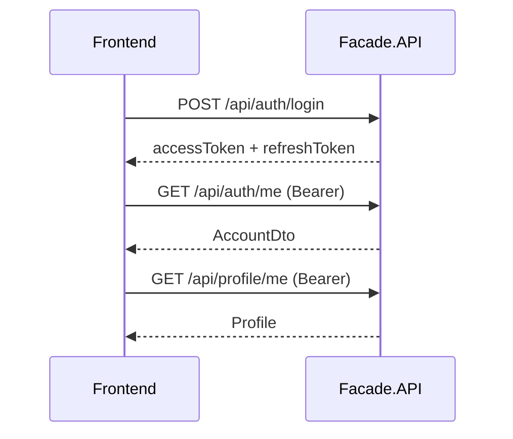

# 25. Frontend Integration Guide

> Практическое руководство для React-frontend: как подключиться к backend LinkedInDiplom.

---

## 1. Базовый URL

| Среда | Backend URL |
|-------|-------------|
| Dev (HTTP) | `http://localhost:5000` |
| Dev (HTTPS) | `https://localhost:7011` |
| Frontend (Vite) | `http://localhost:5173` |

В `.env` frontend:

```
VITE_API_BASE_URL=http://localhost:5000
```

CORS в Development разрешает `localhost:5173` с credentials.

---

## 2. JWT — хранение и заголовок

### Login / Register

```
POST /api/auth/login
POST /api/auth/register
```

Response содержит `accessToken`, `refreshToken`, `expiresAt`.

**Рекомендация:** хранить tokens в `localStorage` или `sessionStorage` (текущий frontend использует localStorage).

### Каждый protected request

```
Authorization: Bearer <accessToken>
```

### Refresh при 401

```
POST /api/auth/refresh
Body: { "refreshToken": "..." }
```

Если refresh не удался → logout, redirect на login.

### Текущий пользователь

```
GET /api/auth/me
Authorization: Bearer ...
```

---

## 3. Auth flow (минимальный)



**External login:** `POST /api/auth/google`, `POST /api/auth/facebook` — body с provider token (см. `05_API_AUTH_JWT.md`).

---

## 4. Profile

| Действие | Endpoint |
|----------|----------|
| Мой профиль | `GET /api/profile/me` |
| Обновить | `PUT /api/profile/me` или `PATCH /api/profile/me` |
| Чужой профиль | `GET /api/profile/{userId}` |
| Поиск людей | `GET /api/profile/search?q=...&page=1&pageSize=20` |
| Avatar upload | `POST /api/profile/me/avatar` (multipart `file`) |
| Header upload | `POST /api/profile/me/header` (multipart) |
| Удалить avatar | `DELETE /api/profile/me/avatar` |
| Удалить header | `DELETE /api/profile/me/header` |

**URL картинок:** backend возвращает либо `/uploads/...` (local), либо `https://bucket.s3.region.amazonaws.com/...`. Frontend должен:

- для `/uploads/...` — prepend `VITE_API_BASE_URL`
- для S3 HTTPS — использовать URL as-is

---

## 5. Content (feed, posts, engagement)

| Действие | Endpoint | Auth |
|----------|----------|------|
| Feed | `GET /api/content/feed?page=1&pageSize=10` | optional JWT (network-aware с JWT) |
| Мои посты | `GET /api/content/me/posts` | ✓ |
| Посты пользователя | `GET /api/content/users/{userId}/posts` | — |
| Создать пост | `POST /api/content/me/posts` | ✓ |
| Комментарии | `GET/POST /api/content/posts/{postId}/comments` | ✓ |
| Реакция | `PUT/DELETE /api/content/posts/{postId}/reactions` | ✓ |
| Upload media | `POST /api/content/me/media/upload` | ✓ |
| Attach media к post | `POST /api/content/me/posts/{postId}/media` | ✓ |
| Hashtags search | `GET /api/content/hashtags?search=...` | ✓ |

**Pagination:** query `page`, `pageSize` (или `skip`/`take` на части endpoints — см. `PagedRequest`).

Response: `{ items: [...], totalCount: N, page, pageSize }`.

---

## 6. Network

| Действие | Endpoint |
|----------|----------|
| Contacts | `GET /api/network/me/contacts` |
| Incoming pending | `GET /api/network/me/contacts/incoming` |
| Send request | `POST /api/network/me/contacts` |
| Accept | `PATCH /api/network/me/contacts/{id}/accept` |
| Follow | `POST /api/network/me/following` |
| Followers | `GET /api/network/me/followers` |
| Following | `GET /api/network/me/following` |

---

## 7. Messaging

| Действие | Endpoint |
|----------|----------|
| Chats list | `GET /api/messaging/me/chats` |
| Create chat | `POST /api/messaging/me/chats` |
| Messages | `GET /api/messaging/me/chats/{chatId}/messages` |
| Send message | `POST /api/messaging/me/chats/{chatId}/messages` |
| Mark read | `POST /api/messaging/me/messages/{messageId}/read` |

**SignalR (realtime):** см. [18_SIGNALR_CHAT.md](18_SIGNALR_CHAT.md). HTTP send остаётся primary; SignalR — для live updates.

---

## 8. Jobs

| Действие | Endpoint |
|----------|----------|
| Vacancies list | `GET /api/jobs/vacancies?search=...&minSalaryFrom=80000&page=1` |
| Vacancy detail | `GET /api/jobs/vacancies/{id}` |
| Apply | `POST /api/jobs/me/vacancies/{id}/apply` |
| Favorites | `GET/POST/DELETE /api/jobs/me/favorites/{id}` |
| Recommended queries | `GET /api/jobs/recommended-queries` |

---

## 9. Professional

| Действие | Endpoint |
|----------|----------|
| Skills catalog | `GET /api/professional/skills?search=React` |
| My skills | `GET /api/professional/me/skills` |
| Add skill | `POST /api/professional/me/skills` |
| Experience | `GET/POST /api/professional/me/experiences` |
| Public experience | `GET /api/professional/users/{userId}/experiences` |

---

## 10. Notifications

```
GET /api/notifications/me?page=1&pageSize=20
PATCH /api/notifications/me/{id}/read
PATCH /api/notifications/me/read-all
```

---

## 11. Admin (роль Admin)

Все под `/api/admin/*` — требуют JWT + role `Admin`. См. [04_FACADE_MODULES.md](04_FACADE_MODULES.md).

---

## 12. Обработка ошибок

### Validation (400)

```json
{
  "success": false,
  "errors": ["Email: invalid format"],
  "fieldErrors": { "Email": ["invalid format"] }
}
```

Frontend: показывать `fieldErrors` рядом с полями формы.

### Business errors (400/404)

Facade services возвращают `{ success: false, errors: ["..."] }` — показывать первую ошибку пользователю.

### 401 Unauthorized

Token expired/invalid → попробовать refresh → иначе logout.

### 403 Forbidden

Нет прав (например Admin endpoint) → показать «Access denied».

---

## 13. File upload (общий паттерн)

```javascript
const formData = new FormData();
formData.append('file', file); // имя поля зависит от endpoint — обычно 'file'

fetch(`${API}/api/profile/me/avatar`, {
  method: 'POST',
  headers: { Authorization: `Bearer ${token}` },
  body: formData  // НЕ ставить Content-Type — browser сам добавит boundary
});
```

---

## 14. Demo credentials (Development)

| User | Email | Password |
|------|-------|----------|
| Admin | admin@local.dev | Admin123! |
| Primary showcase | marya101204@gmail.com | из DemoSeed options |
| Test | test@example.com | Test123! |

Полный список seed users — [22_SEED_DATA.md](22_SEED_DATA.md).

---

## 15. Smoke checklist для frontend-разработчика

1. Login → `/api/auth/me` → `/api/profile/me`
2. Feed → posts render with author info
3. Create post → appears in feed
4. Upload avatar → URL updates in profile
5. Network → contacts/followers load
6. Messages → chat list + send message
7. Jobs → vacancies with filters
8. Skills autocomplete on profile

Детальный Postman checklist — [api/POSTMAN_TESTING.md](api/POSTMAN_TESTING.md).
